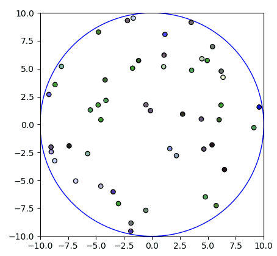
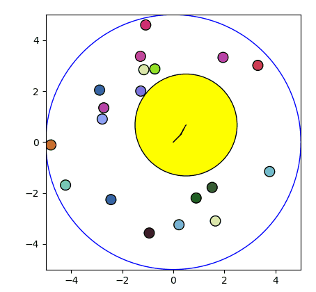

# xkykai 2D Rigid Disc Collision Simulation
## Modelling 2D gas particles and Brownian Motion for thermodynamic and stastical physics investigations.

---

*Simulation Visualisation*

*Brownian Motion*

## Important Notes
There are 2 versions to most scripts: X_SCRIPT.py and X_SCRIPT_PARALLEL.py. X_SCRIPT_PARALLEL.py are multi-core processing enabled. I have written a parallelised version for scripts worth parallelising.

It is recommended to run the scripts from the terminal to ensure the custom progress bar and parallelisation works properly. However, running in iPython works just fine too.

When running scripts in terminal, the code will be blocked when the GUI shows the graph plotted. Close the GUI window after examining the plot to continue running the script.

---

## Installation
Clone this repo into your machine and run numbered scripts to see the features in this simulation.

---

## Physics Investigation Features
- Pressure
- Temperature
- Maxwell-Boltzmann Distribution
- Ball Positions from Origin
- Position and Velocity Dataset
- Brownian Motion Path Tracing
- Characterisation of Brownian Motion
- Brownian Motion Dataset

---

### Modules
ball.py : Contains the *Ball* and *Container* Class and methods for gas particles and container.  
event.py : Contains the *Event* Class for next collision events.  
simulation.py : Contains the *Simulation* Class and methods for simulation.

---

### Class Hierarchy
*Simulation* has a: *Ball*, *Container*, *Event*  
*Container* is a: *Ball*  
*Event* is a: *tuple*

---

### Support
Contact me at xin.lee18@imperial.ac.uk
